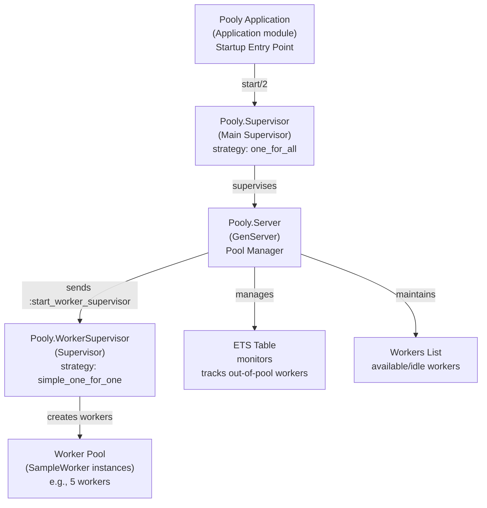
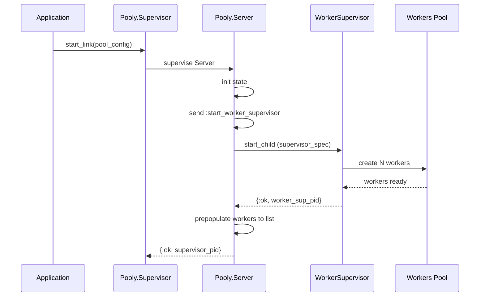

# Pooly

**TODO: Add description**

## Step Learning

```elixir
{:ok , worker_sup} = Pooly.WorkerSupervisor.start_link({ SampleWorker , :start_link, []})

Supervisor.start_child(worker_sup , [[]])
Supervisor.which_children(worker_sup)
Supervisor.count_children(worker_sup)


 {:ok , worker_pid }= Supervisor.start_child(worker_sup , [[]])
 SampleWorker.stop(worker_pid)
 Supervisor.which_children(worker_sup)


:ets.new(:mum_faves, [])
:ets.new(:mum_faves, [:set])
# for process ownership
:ets.new(:mum_faves, [:set, :private])


:ets.new(:mum_faves, [:set , :private , :named_table])

:ets.insert(:mum_faves, {"Bodyslam" , 2025, "Rock"})
:ets.insert(:mum_faves, {"Oat Pramote" , 2025, "Pop"})
:ets.insert(:mum_faves, {"GOT7" , 2025, "Pop"})
:ets.insert(:mum_faves, {"Silly fool" , 2025, "Rock"})
:ets.insert(:mum_faves, {"Potato" , 2025, "Rock"})
:ets.tab2list(:mum_faves)

:ets.delete(:mum_faves, "GOT7")

:ets.lookup(:mum_faves, "Bodyslam")

:ets.match(:mum_faves, {:"$1", 2025, :"$2"})

:ets.match(:mum_faves, {:"$2", 2025, :"$1"})

:ets.match(:mum_faves, {:"$1", 2025, :"_"})


pid = spawn(fn ->
    :timer.sleep(2000)
    exit(:boom)
  end)
ref = Process.monitor(pid)
flush()


:observer.start()

```

📊 Pooly Architecture



🔄 Sequence diagram


